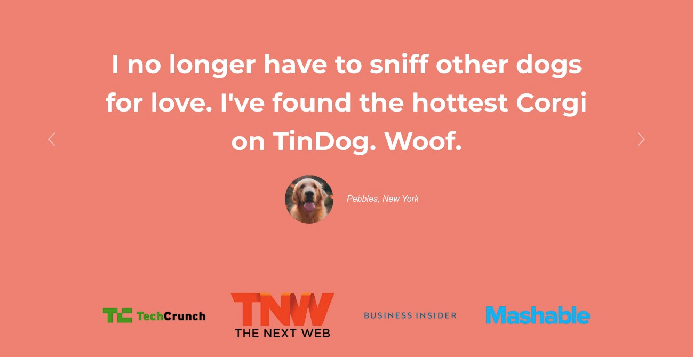
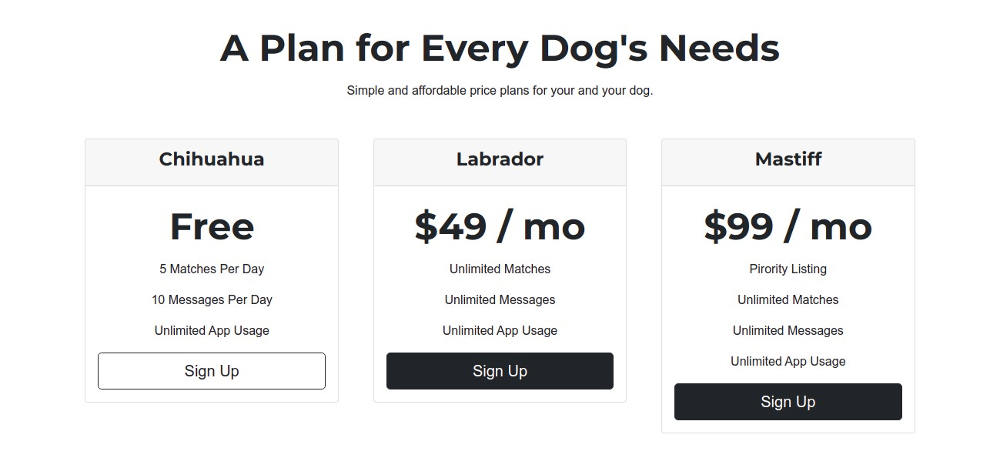
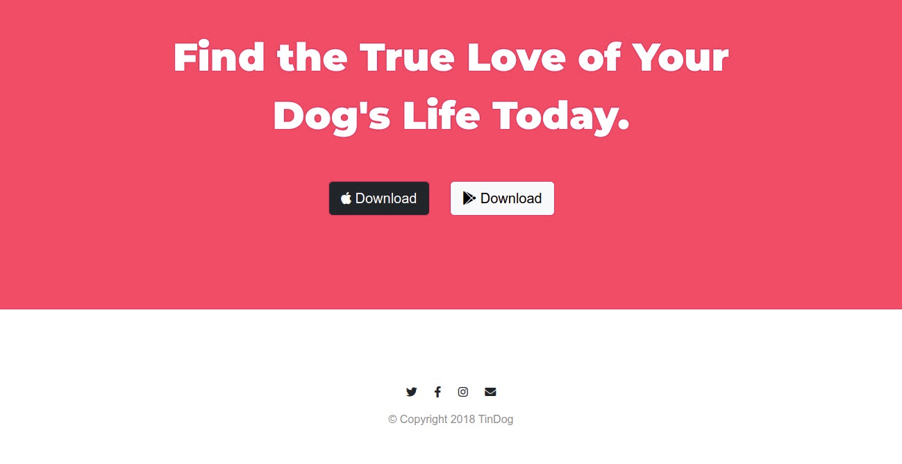

# TinDog Website - tinder for Dogs 

## Table of contents

- [Overview](#overview)
  - [Discription](#discription)
  - [Screenshot](#screenshot)
  - [Links](#links)
- [My process](#my-process)
  - [Built with](#built-with)
  - [What I learned](#what-i-learned)
  - [Useful resources](#useful-resources)
- [Author](#author)
- [Acknowledgments](#acknowledgments)

## Overview

### Discription

This is a responsive website for tinDog, a tinder for dogs. You can sign up your dog and meet cute dogs near you!
View the feature, testimonials and pricing for various plans.

### Screenshot

Home Page:

Testimony:

Pricing:

Footer:

### Links

- Live Site URL: [Add live site URL here](https://your-live-site-url.com)

## My process

### Built with

- Semantic HTML5 markup
- Bootstrap 5
- CSS custom properties 

### What I learned

- Bootstrap 5 basics
- Bootstrap Carousels
- Bootstrap Grids
- Making a responsive website 
- Media Query

### Useful resources

- [Bootstrap](https://getbootstrap.com/docs/5.0/getting-started/introduction/) - Official website for Bootstrap has many examples and syntax.
- [Font Awesome](https://fontawesome.com/) - Website for free icons.
- [Google fonts](https://fonts.google.com/) - Website for embedding fonts.
- [CodePly](https://www.codeply.com/) - Live playground for Bootstrap, CSS and more.
- [The Complete 2021 Web Development Bootcamp](https://www.udemy.com/course/the-complete-web-development-bootcamp/)

## Author

- Frontend Mentor - [@MayuraRane](https://www.frontendmentor.io/profile/MayuraRane)
- Twitter - [@mayura_rane](https://www.twitter.com/mayura_rane)
- LinkedIn - [@mayurarane](https://www.linkedin.com/in/mayurarane/)

## Acknowledgments

It is a website taugh in the Udemy course [The Complete 2021 Web Development Bootcamp](https://www.udemy.com/course/the-complete-web-development-bootcamp/).
